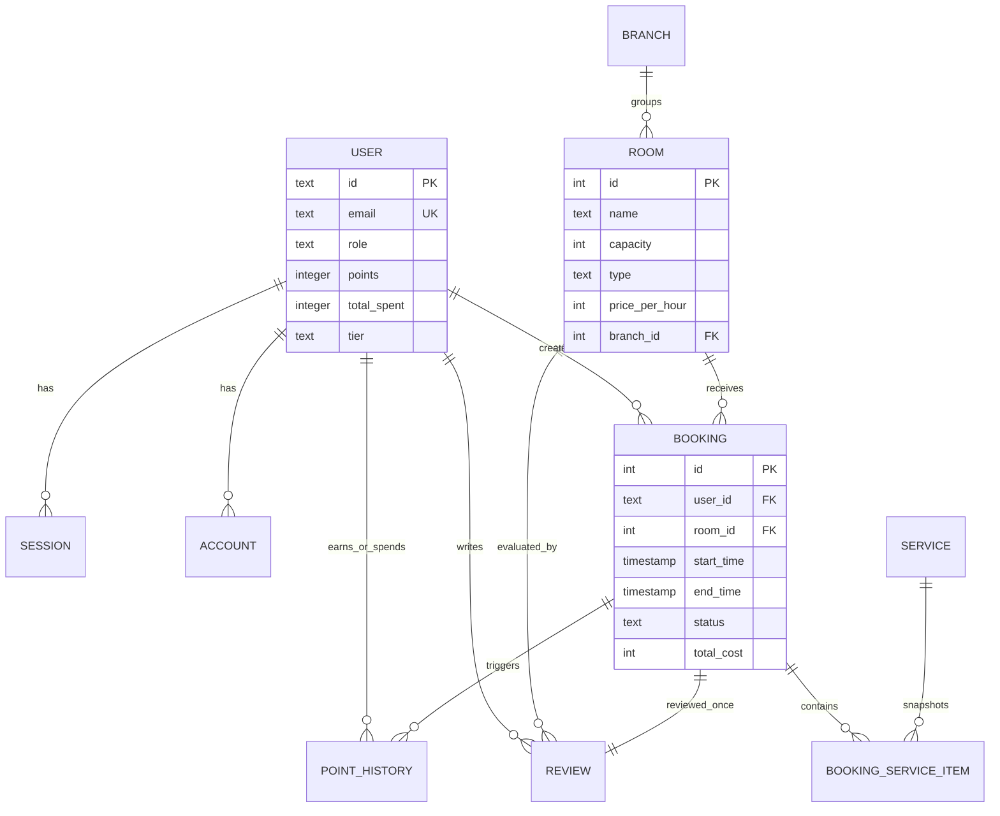

# Database Design

## Objective

This document explains the physical relational database design implemented through Drizzle schemas and migration artifacts.

- Evidence basis: direct
- Confidence level: 0.95

## Database Technology

The repository uses PostgreSQL as the database engine and Drizzle ORM/Drizzle Kit as the schema and migration layer. The schema is defined in TypeScript and partially reflected in generated SQL migrations.

## Tables and Purposes

| Table                  | Purpose                                                   |
| ---------------------- | --------------------------------------------------------- |
| `user`                 | stores user identity, role, ban status, and loyalty state |
| `session`              | stores active session records                             |
| `account`              | stores auth-provider account linkage                      |
| `verification`         | stores verification lifecycle data                        |
| `room`                 | stores karaoke room inventory                             |
| `branch`               | stores branch/location data                               |
| `booking`              | stores reservation transactions                           |
| `booking_service_item` | stores selected services per booking                      |
| `service`              | stores add-on offerings                                   |
| `promotion`            | stores voucher campaigns                                  |
| `pricing_rule`         | stores dynamic pricing multipliers                        |
| `point_history`        | stores loyalty events                                     |
| `review`               | stores room review submissions                            |
| `setting`              | stores business/site configuration                        |
| `activity_log`         | stores operational audit events                           |
| `task`                 | auxiliary table with limited visible application use      |

## Selected Table Designs

### `user`

Notable fields:

- `email` is unique.
- `role` defaults to `user`.
- `points`, `total_spent`, and `tier` support loyalty state.
- `updated_at` is auto-updated.

Design rationale:

- the user table combines identity and customer-value attributes, which simplifies queries for profile and loyalty workflows.

### `room`

Notable fields:

- `branch_id` is nullable and uses `onDelete: set null`.
- `price_per_hour` stores the base price.

Design rationale:

- nullable branch assignment supports gradual branch adoption or inventory setup before organizational assignment.

### `booking`

Notable fields:

- foreign keys to `user` and `room`;
- optional `guest_count`;
- status string with default `pending`;
- optional `total_cost`;
- voucher and loyalty accounting fields.

Design rationale:

- the booking table carries both workflow state and commercial outcome, making it the primary transactional fact table.

### `booking_service_item`

Notable fields:

- foreign keys to `booking` and `service`;
- `quantity`;
- `price_at_booking`.

Design rationale:

- this table preserves transactional history independently of later service edits.

### `promotion`

Notable fields:

- unique `code`;
- active/public flags;
- usage counters and expiry.

Design rationale:

- the schema supports both internal management and public promotional display.

### `pricing_rule`

Notable fields:

- `type` enum-like text constrained to `holiday` or `time_block`;
- optional `start_time`, `end_time`, `date`, and `days_of_week`;
- `multiplier`.

Design rationale:

- this schema supports two pricing modes without a separate inheritance structure.

### `review`

Notable fields:

- foreign keys to `user`, `booking`, and `room`;
- `rating`;
- optional `comment`;
- unique index on `booking_id`.

Design rationale:

- uniqueness on `booking_id` enforces a business rule of one review per booking.

## Relationships

### Directly Defined Relations

The explicit `relations.ts` file defines:

- user -> sessions
- user -> accounts
- room -> bookings
- booking -> room
- booking -> user

### Additional Relations Evident from Foreign Keys

Even where Drizzle relation helpers are not fully expanded, foreign keys clearly define:

- branch -> rooms
- booking -> booking service items
- service -> booking service items
- booking -> reviews
- room -> reviews
- user -> reviews
- user -> point history
- booking -> point history

## Indexes and Constraints

### Observed Indexes

| Index                                 | Purpose                                             |
| ------------------------------------- | --------------------------------------------------- |
| `booking_room_status_time_idx`        | supports room/time/status availability checks       |
| `booking_user_created_at_idx`         | supports user booking history ordering              |
| `point_history_user_booking_type_idx` | supports loyalty event lookup per user/booking/type |
| `point_history_booking_type_idx`      | supports booking-linked loyalty event lookup        |
| `review_booking_id_unique`            | enforces one review per booking                     |
| `account_userId_idx`                  | supports account lookups by user                    |
| `session_userId_idx`                  | supports session lookups by user                    |
| `verification_identifier_idx`         | supports verification record lookup by identifier   |

### Primary and Unique Constraints

- primary keys exist on all core tables;
- `user.email` is unique;
- `session.token` is unique;
- `promotion.code` is unique;
- `review.booking_id` is unique through a unique index.

### Foreign-Key Deletion Behavior

Observed strategies include:

- `cascade` for child data tightly bound to the parent;
- `set null` for relationships where history should remain after entity deletion, such as `activity_log.user_id`, `point_history.booking_id`, and `room.branch_id`.

## Mermaid ER Diagram

## Why the Database Was Designed This Way

The design reflects the needs of a practical business transaction system:

- relational integrity is important because users, rooms, bookings, reviews, and loyalty events are strongly connected;
- transactional consistency matters because overlapping bookings must be prevented;
- queryability matters because admin reporting depends on joins, counts, grouping, and ordered history;
- configurability matters because settings, promotions, and pricing rules should evolve without schema redesign.

## Database Design Strengths

- clear normalization of core business entities;
- strong fit for transactional booking workflows;
- explicit indexing of known lookup patterns;
- good support for analytics and history views;
- auditable loyalty and review behavior.

## Database Design Risks or Gaps

- there is no evidence of partitioning or archival strategy for future growth;
- no committed migration commentary explains versioning policy beyond Drizzle artifacts;
- relations helper coverage is partial, although foreign-key intent remains clear.

## Summary

The database design is solid for a graduation-scale business system. It is understandable, relationally coherent, and appropriately aligned with the application’s concurrency-sensitive booking logic and reporting requirements.
