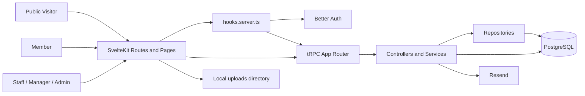
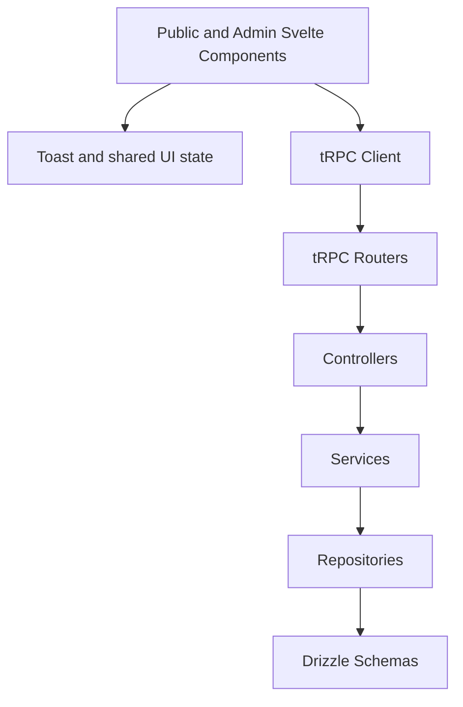
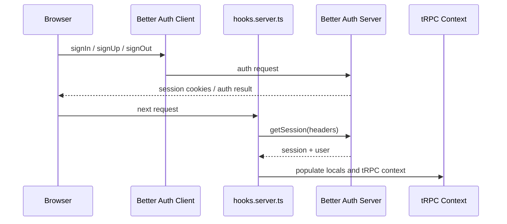
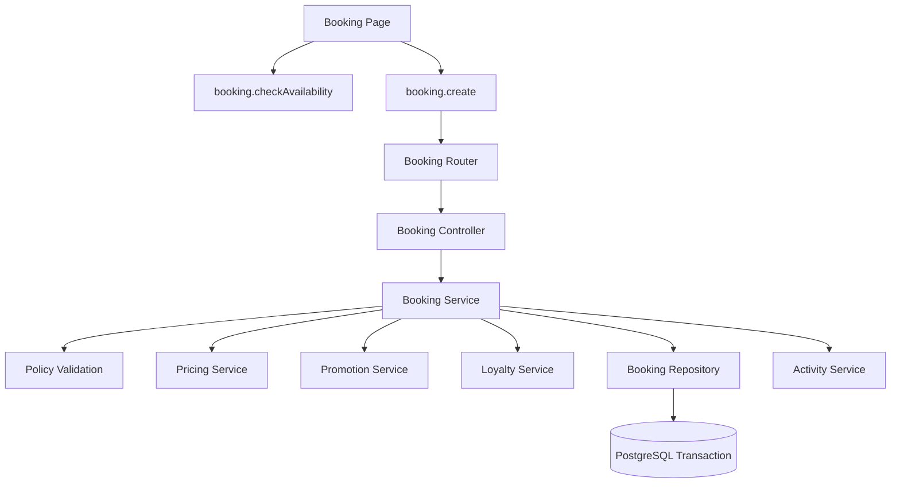
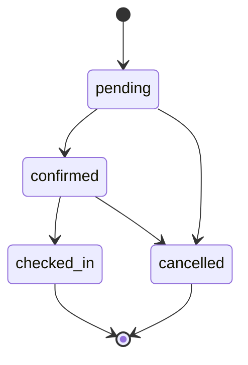
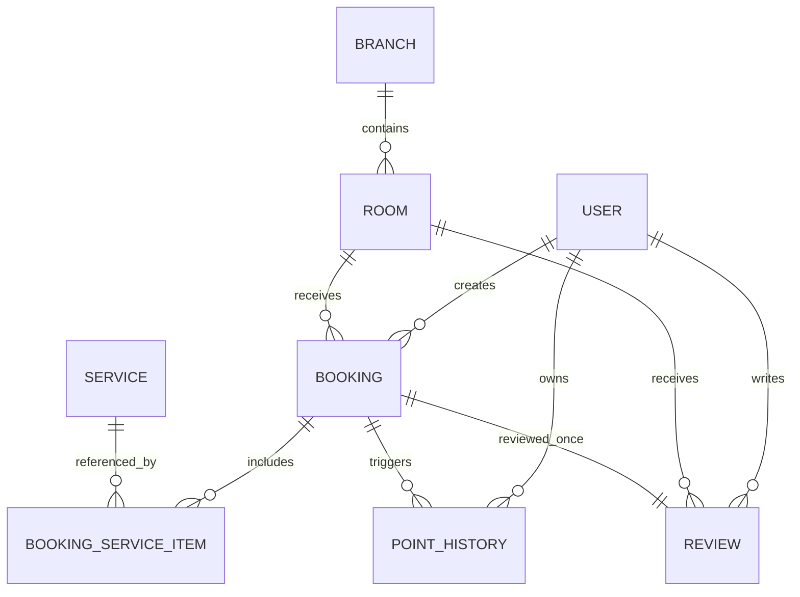
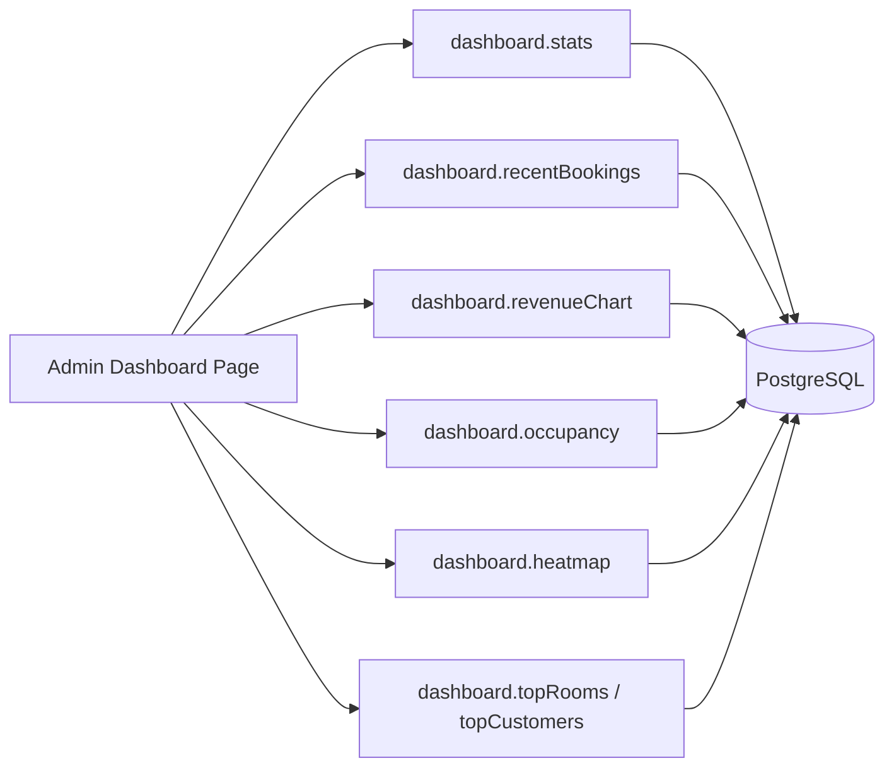
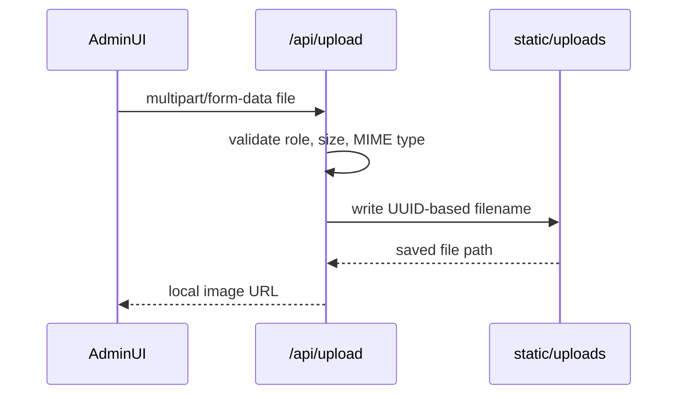
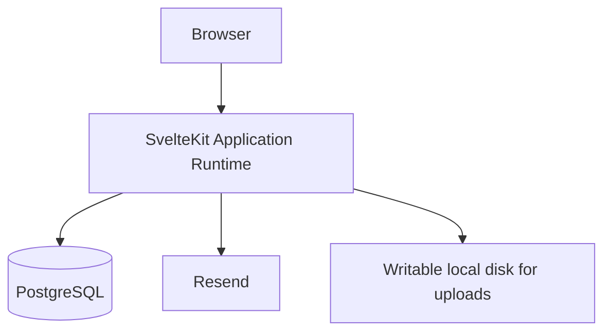
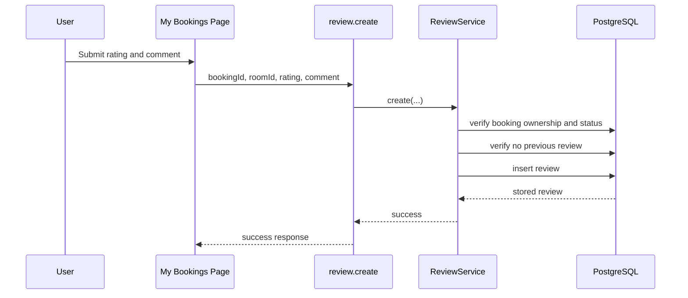

# Diagrams

## Objective

This document collects Mermaid diagrams that can be reused in a thesis, presentation, architecture review, or onboarding package.

- Evidence basis: direct and derived
- Confidence level: 0.90

## 1. System Architecture Diagram

## 2. Component Diagram

## 3. Authentication Flow Diagram

## 4. Booking Request Flow Diagram

## 5. Booking Status Transition Diagram

## 6. ER Diagram

## 7. Dashboard Data Flow Diagram

## 8. Upload Flow Diagram

## 9. Deployment Diagram

## 10. Sequence Diagram for Review Submission

