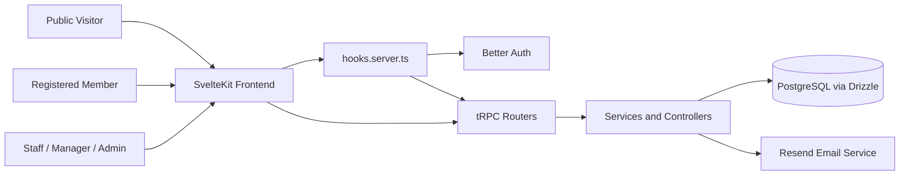
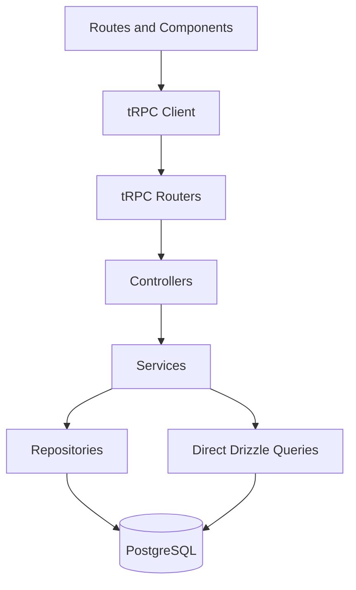

# System Analysis and Design

## Objective

This document connects the project’s business requirements with its implemented system design. It explains the architecture style, module responsibilities, data flow, and key design decisions in a form suitable for thesis and system-analysis chapters.

- Evidence basis: direct and derived
- Confidence level: 0.92

## Overall System Analysis

The system is designed to support two interconnected operational spaces:

- the public and member-facing reservation space;
- the internal administrative and operational management space.

These spaces share one codebase, one authentication domain, and one relational database. This indicates a unified enterprise-style information system rather than a collection of isolated applications.

The analysis of the codebase shows that the highest-risk business process is booking creation. As a result, the design prioritizes:

- validated inputs;
- synchronized session context;
- transactional writes;
- overlap prevention;
- policy-driven constraints;
- reversible loyalty and promotion side effects.

## Architecture Style

The architecture style can be summarized as a layered monolithic web application with first-party typed RPC communication.

### Design Characteristics

- single deployable application runtime;
- integrated frontend and backend in SvelteKit;
- typed tRPC communication between UI and application services;
- centralized PostgreSQL persistence;
- service-oriented domain logic within a monolith;
- external integration limited primarily to transactional email.

## Main Modules

| Module                     | Responsibility                                                                      |
| -------------------------- | ----------------------------------------------------------------------------------- |
| Public storefront          | Present rooms, services, promotions, contact information, and booking entry points  |
| Authentication and profile | Register, log in, verify email, maintain account identity, manage password and name |
| Booking engine             | Validate policy, prevent overlaps, compute price, apply discounts, persist bookings |
| Loyalty management         | Track points, tiers, redemption, refunds, and reversals                             |
| Promotion management       | Validate and reserve voucher usage                                                  |
| Service catalog            | Maintain add-on services and image assets                                           |
| Room and branch management | Maintain inventory structure and branch assignment                                  |
| Dashboard and reporting    | Compute KPI cards, charts, occupancy, heatmap, rankings, and exports                |
| Review and recommendation  | Capture review feedback and propose alternatives or popular services                |
| Settings and configuration | Externalize site metadata and business policy                                       |
| Activity logging           | Record administrative and operational actions                                       |

## Responsibilities of Each Layer

### Frontend

- gathers user intent through forms and interactive admin screens;
- requests data from tRPC procedures;
- handles client navigation and user notifications;
- displays analytics and workflow states.

### Server Hook and Auth Integration

- resolves session identity;
- normalizes identity into `event.locals`;
- ensures consistent user context for page loads and tRPC requests.

### tRPC Layer

- defines callable operations;
- validates inputs with Zod;
- enforces authorization and rate limiting;
- exposes the backend in a first-party contract.

### Service Layer

- applies business rules;
- coordinates transactional behavior;
- performs multi-entity logic;
- triggers post-persistence side effects.

### Repository and Database Layer

- executes data access patterns;
- applies relational constraints and indexes;
- supports reporting queries and transaction scopes.

## Data Flow

### Frontend to Backend to Database

1. A page or component calls `trpc()` with a typed procedure.
2. The request reaches `/api/trpc`.
3. The tRPC router validates the payload and checks authorization.
4. A controller or service processes the request.
5. Repositories or direct Drizzle queries read/write PostgreSQL.
6. A result shape is returned to the UI.

### Authentication Flow

1. The client uses Better Auth helpers for sign-up, sign-in, sign-out, and verification resend.
2. Better Auth stores and resolves session state.
3. `hooks.server.ts` attaches `user` and `session` to the request.
4. Layout server loads expose session identity to pages.
5. tRPC procedures receive the same identity through `createContext()`.

### External Service Flow

1. A triggering event occurs, such as sign-up or booking confirmation.
2. `EmailService` loads sender information and site metadata.
3. The Resend client sends a transactional email.
4. Failures are surfaced as exceptions or logged, depending on the workflow.

## Important Design Decisions

### Transaction-Backed Booking Consistency

The booking subsystem uses a database transaction plus `pg_advisory_xact_lock(roomId)` to reduce race conditions during concurrent reservation attempts. This is an important design decision because availability is a shared mutable resource.

### Policy Centralization in Settings

Booking rules and loyalty thresholds are not fixed exclusively in code. The service layer retrieves values from settings, enabling non-developer policy adjustment.

### Server-Side Authorization as the Source of Truth

Page guards redirect users away from protected areas, but meaningful authorization is enforced inside shared tRPC procedures. This protects the application even if the client is bypassed.

### Narrow HTTP Surface

Most application behavior uses tRPC. Plain HTTP routes are reserved for integrations and special cases such as Better Auth callbacks, uploads, and booking export.

## Mermaid Diagrams

### System Context Diagram

### Layered Design Diagram

## Design Evaluation

The design is suitable for a graduation project because it demonstrates:

- clear separation of concerns;
- concurrency-aware domain modeling;
- real business policy enforcement;
- relational data design;
- layered backend structure;
- typed frontend-backend coordination.

Its main limitations are not architectural confusion, but operational incompleteness: limited committed tests, absence of committed deployment automation, and limited infrastructure observability.
