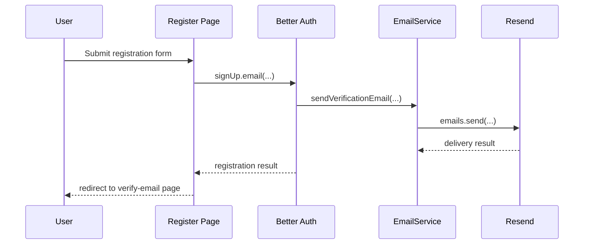
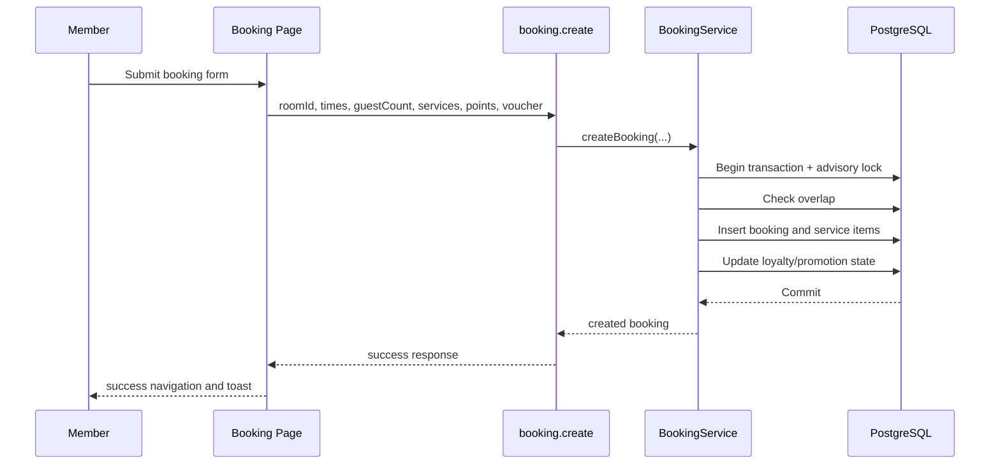

# User Workflows

## Objective

This document explains the main user journeys through the system, including step-by-step behavior, edge cases, and sequence diagrams suitable for a thesis or defense presentation.

- Evidence basis: direct and derived
- Confidence level: 0.91

## Workflow 1: Public Visitor Browses Rooms

### Steps

1. The visitor opens the home page or the rooms page.
2. The frontend requests public settings and room data through tRPC.
3. The visitor enters desired start and end times and an optional capacity requirement.
4. The frontend calls `room.findAvailable`.
5. The backend validates the date range and returns candidate rooms.
6. The visitor may continue to a specific booking page.

### Edge Cases

- invalid or missing date input leads to a failed availability lookup;
- no available rooms returns an empty result set rather than a broken flow.

## Workflow 2: User Registration and Email Verification

### Steps

1. The user opens the registration page.
2. The frontend calls Better Auth `signUp.email(...)`.
3. The account is created and the system initiates email verification.
4. `EmailService` sends a verification email through Resend.
5. The user is redirected to the verification page.
6. The user opens the verification link.
7. Better Auth processes the token and marks the email as verified.

### Edge Cases

- expired token;
- invalid token;
- user not found for verification;
- email-delivery failure when sending the verification message.

### Sequence Diagram

## Workflow 3: Login and Session Reuse

### Steps

1. The user submits login credentials.
2. Better Auth authenticates the user and issues session state.
3. On later requests, `hooks.server.ts` resolves the session.
4. Layout server loads and tRPC procedures both receive the same user/session identity.
5. Protected pages and procedures become accessible according to role.

### Edge Cases

- invalid password;
- banned account;
- session missing or expired;
- protected route redirect back to login.

## Workflow 4: Booking Creation

### Steps

1. An authenticated member opens `/booking/[roomId]`.
2. The page loads room data, public services, and optionally loyalty info.
3. The member chooses a time range, guest count, optional services, and optional voucher.
4. The page checks availability and receives an estimated room cost.
5. The member submits the booking.
6. The backend validates policy, guest count, service availability, voucher rules, and loyalty use.
7. The transaction persists booking and selected services.
8. The user is redirected toward their booking history or receipt-related flow.

### Edge Cases

- booking time in the past;
- booking duration shorter or longer than policy;
- booking too far in advance;
- guest count above capacity;
- service unavailable;
- invalid or exhausted voucher;
- insufficient loyalty points;
- room already reserved by the time the transaction executes.

### Sequence Diagram

## Workflow 5: Member Cancels Own Booking

### Steps

1. The member opens `my-bookings`.
2. The page loads the current user’s bookings.
3. The member clicks cancel on a pending booking.
4. The system verifies ownership and that status is still `pending`.
5. The booking transitions to `cancelled`.

### Edge Cases

- the booking is no longer pending;
- the booking does not belong to the caller;
- the booking record is missing.

## Workflow 6: Post-Visit Review Submission

### Steps

1. The member opens booking history.
2. The member selects a confirmed or checked-in booking to review.
3. The page submits `review.create`.
4. The backend verifies booking ownership, room match, and `checked_in` status.
5. The backend checks that no review already exists for the booking.
6. The review is stored.

### Edge Cases

- booking not checked in yet;
- duplicate review attempt;
- room mismatch;
- booking owned by another user.

## Workflow 7: Admin Booking Operations

### Steps

1. An admin opens the bookings management page.
2. The page loads enriched booking data.
3. The admin changes a booking status or checks in a guest.
4. The service validates the status transition.
5. Loyalty side effects and voucher release logic execute when applicable.
6. Confirmation or cancellation emails may be sent.

### Edge Cases

- illegal status transition;
- already-in-target-status update;
- email delivery failure after a successful database change.

## Workflow 8: Admin Content and Policy Management

### Scope

This includes rooms, services, promotions, pricing, settings, branches, users, and reviews.

### General Steps

1. A privileged user opens an admin page.
2. The page loads current records with one or more tRPC queries.
3. The user edits, creates, or deletes records.
4. The backend validates inputs and permissions.
5. Activity log entries are written for many mutations.

### Edge Cases

- invalid numeric or enum fields;
- insufficient privileges;
- deletion blocked by dependent domain rules, such as room deletion with active bookings.

## Workflow 9: Administrative Export and Upload

### Export

1. An admin or manager requests the booking export endpoint.
2. The backend returns a CSV file for operational use.

### Upload

1. An admin or manager uploads an image from the service-management page.
2. The backend validates the file and stores it under `static/uploads`.
3. The returned URL is later saved through the service-management API.

## Workflow Summary

The user workflows show a clear separation between:

- customer self-service actions;
- privileged operational actions;
- cross-cutting trust and policy enforcement.

For thesis purposes, the most important journey is booking creation because it combines authentication, validation, pricing, concurrency control, discounting, loyalty, persistence, and audit logging in a single end-to-end workflow.
